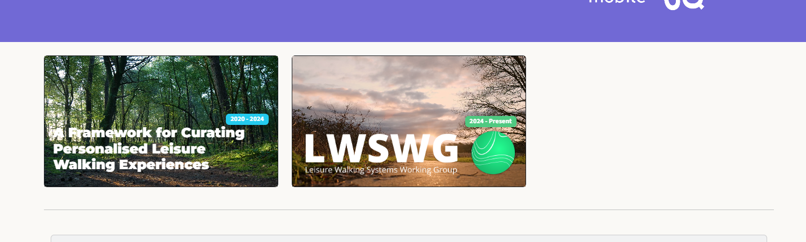
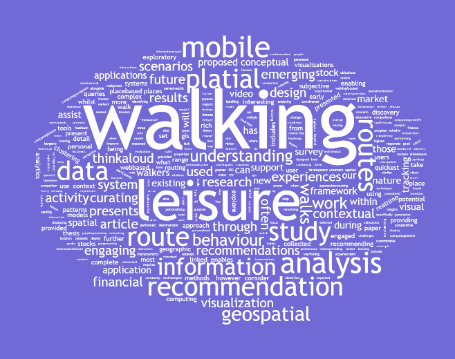

You may have realised while browsing this website that it has been recently updated and under development. The new website has been designed to enhance the presentation of research conducted and support more engaging overviews of my work. As part of this process, the website has undergone several improvements in technology and domain organisation.

My history of updating my own website has been poor, however, over the last few months I have been slowly building a series of new interfaces for presenting my research publications, research projects, and an informal blog. The current interface was selected due to the organised view and easy to understand structure. This will hopefully help me in focusing on producing content for the website as opposed to refactoring web pages.

This article will briefly present the current status of the website architecture, explaining the choices made and highlighting my future focus.

### Website Architecture

The new website layout is split into three core components. These components are represented in the diagram above and include the main website ([https://jwilliams.science](https://jwilliams.science)) representing the project and software overviews, the blog website ([https://blog.jwilliams.science](https://blog.jwilliams.science)) representing this blog, and the potential for future sub-domains for projects (e.g., [https://lwswg.jwilliams.science](https://lwswg.jwilliams.science)).

The new architecture enables each component to be stored separately in correlated GitHub repositories. This also enables possible future expansion.

### Purpose of Website

When considering the layout and design of the new website, I first had to consider what type of content would be displayed on it. The initial intention of the website was to present my recent projects and publications.

My previous website had functionality of manually updating HTML code to update publications and HTML pages to update projects. This website uses [bibtex.js](https://github.com/pcooksey/bibtex-js) to automatically generate a list of publications from an associated .bib file. This improvement should mean that one GitHub change can update my list of publications.

For project pages I retained the same HTML format as previous, updating the design to be more visually appealing through the use of background videos and longer write-ups. At present, I am continuing to update these write-ups to be accurate to the projects. Example pages include the [LWSWG](https://jwilliams.science/research/lwswg.html) and [Leisure Walking Framework](https://jwilliams.science/research/LeisureWalkingFramework.html) pages.

### A Website Built for Projects

A question I asked myself while building this new website was if I wanted to use templates for project pages?

If I had used templates the whole website could be published using Jekyll through GitHub Pages (More on this later), however, this approach would retain a similar style for each of the project pages. Instead, customised HTML pages were still used to enable future interactivity and individual page layouts to be used.

These new project pages enable both long-term and short-term projects to be presented as part of the 'research' page of this website. The project can have a standalone theme while still matching with the overall style of the website. Each new page has serveral key elements including a header with dynamic video background, a infobox panel with short project details, and a main content location for the body text of the project. These project pages can now represent completed or ongoing work.

### Dynamic Publication Display

Using the aforementioned [bibtex.js](https://github.com/pcooksey/bibtex-js) library a dynamic and scalable publication list could be formed, with each of my open access publication available to download through the associated links.

This publication list is also able to display extended details of the publication including keywords and a citation for the relevant article. Each publication also links to the online location of the work or the DOI. Through this all being completed automatically, only a minimal amount of manual development (copying the .bib citation) is needed to update the list of publications.

Using the dynamic list of publications, I also impleted a dynamic word cloud based on the content of the article abstracts. The word cloud was implemented using [wordcloud2.js](https://github.com/timdream/wordcloud2.js/), and enables a dynamic word cloud to be generated using the abstract of the work. The word cloud could be further developed in the future to alter based on publication filtering.

### The Learning Process

Development of the my new website was intended to be a learning process, combining my existing web development skills on the base-level pages (home, research, research pages, etc) with new knowledge formed through the development of a blog. This blog is developed on the great [jekyll-now](https://github.com/barryclark/jekyll-now) package, enabling the writing of blog posts quickly using the .md file format.

This format should mean that blog posts, recent updates, tutorials, and news can be published quickly through GitHub pages. I hope to continue extending the blog in the near future to include pagination and read time suggestions.

As part of this development and learning process, I have identified the following areas for improvement:

#### Ongoing Challenges

- The videos on the research project pages need to be better optimised for networks.
- The software page is not yet complete and a layout is not yet planned.
- The blog does not have pagination at the moment (Note: This has been completed.)
- Several images should also be optimised.

#### Future Goals

- Continue development on a 'software' page.
- Continue posting roughly once a month blog posts depending on availability.
- Continue hosting projects through the sub-domains of the website.

### Closing Statement

The development of this website has enhance my understanding of web-based technologies, particularly those involved in user interface design. The website has also enhanced my knowledge of static site generators and I hope to continue learning about these over the next few months. As part of this new website, I also hope to continue updating this blog sharing tutorials, research, thoughts, and software development posts.
