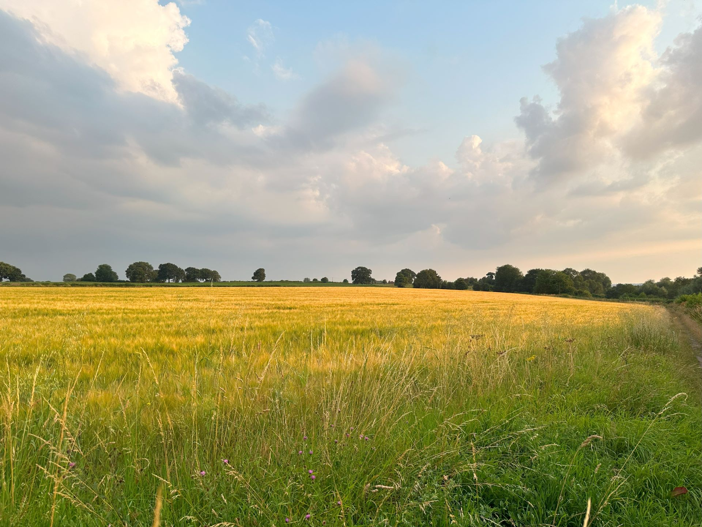

You may have realised while browsing this website that it has been recently updated from the version that I completed 3-years ago. The new website has been designed to enhance the presentation of research conducted and support more engaging overviews of my work. As part of this process, the website has undergone several improvements in technology and domain organisation.

My history of updating my own website has been poor, however, over the last few months I have been slowly building a series of new interfaces for presenting my research publications, research projects, and an informal blog. The current interface was selected due to the organised view and easy to understand structure. This will hopefully help me in focusing on producing content as opposed to refactoring web pages. 

This article will briefly present the current status of the website architecture, explaining the choices made and highlighting my future focus.

### Purpose of Website

When considering the layout and design of the new website, I first had to consider what type of content would be displayed on it. The initial intention of the website was to use...

### A Website Built for Projects

[CONTINUED]

### Dynamic and Scalable Publications

...

### The Learning Process

As part of this process...

#### Ongoing Challenges

...

#### Future Plans

...
